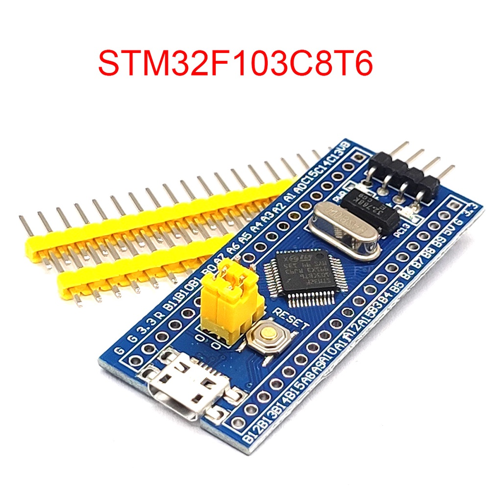
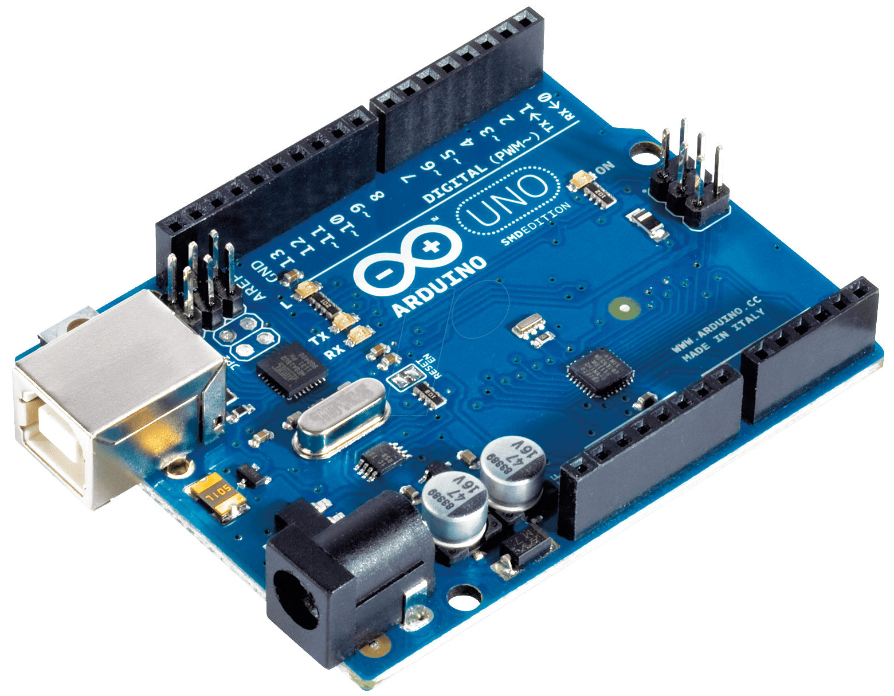
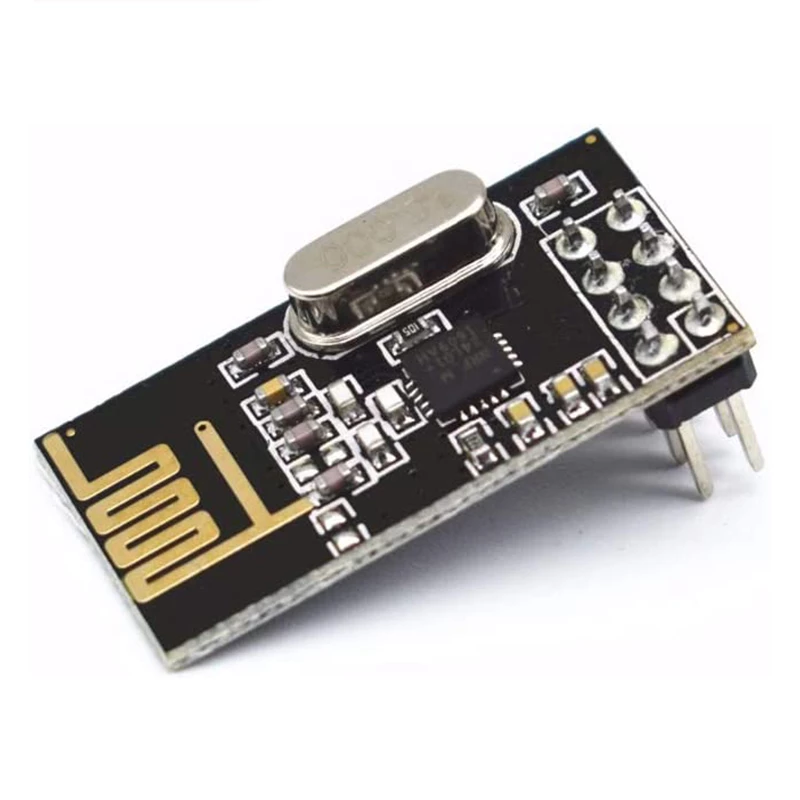
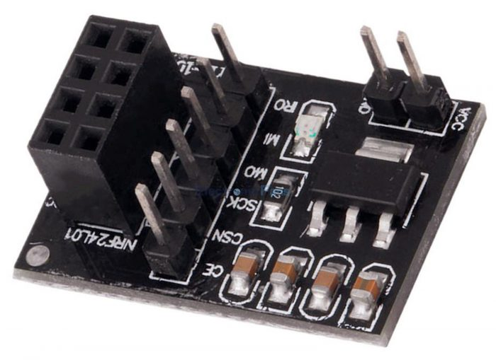

# RadioComm
Este projeto tem como objetivo mostrar a capacidade de uma placa <small>_[STM32F103C8T6](https://www.st.com/en/microcontrollers-microprocessors/stm32f103c8.html)_</small> se comunicar com uma placa <small>_[Arduino Uno R3](https://docs.arduino.cc/hardware/uno-rev3/)_</small> via rádio, usando transceivers <small>_[nRF24l01](https://cdn.sparkfun.com/datasheets/Wireless/Nordic/nRF24L01_Product_Specification_v2_0.pdf)_</small>. O Projeto utiliza da biblioteca <small>_[RF24](https://github.com/nRF24/RF24/tree/stm32cube-support)_</small> para fazer a comunicação entre as placas com o transceiver.

<div style="display:flex; gap:12px; align-items:center;">
    
    
    
    
</div>

## Configuração dos Pinos:

### STM32F103C8T6:
> <small>_Para fazer a comunicação correta entre a placa stm32 e o transceiver é necessário um adaptador, pois o regulador de tensão no stm32 não é capaz de fornecer energia ao nRF24l01._</small>*

| Função        | STM32F103C8T6 |
|---------------|---------------|
| CE            | A3            |
| CSN           | A4            |
| CSK           | A5            |
| MOSI          | A7            |
| MISO          | A6            |

### Arduino Uno:
| Função        | Arduino UNO   |
|---------------|---------------|
| CE            | 7             |
| CSN           | 8             |
| CSK           | 13            |
| MOSI          | 11            |
| MISO          | 12            |

## Ferramentas necessárias:
- [Arm GNU Toolchain](https://developer.arm.com/downloads/-/arm-gnu-toolchain-downloads)
- [CMake](https://cmake.org/)
- [STLINK Tools](https://github.com/stlink-org/stlink) Versão OpenSource.


## Compilação
Para realizar a compilação correta da biblioteca RF24, foi utilizado um wrapper em C. Devido de como o código é gerado, o linker não consegue ligar diretamente ao [_entrypoint_](https://en.wikipedia.org/wiki/Entry_point) do objeto gerado com C++. 

[`gcc-arm-none-eabi.cmake`](./cmake/gcc-arm-none-eabi.cmake) configura as opções de Compilador e do Linker, tal como processador alvo, flags para linkagem e etc..
[`STM32F103.ld`](./linker/STM32F103.ld) dita ao linker como deve ser a arquitetura e configuração de seções do firmware.
[`CMakeLists.txt`](CMakeLists.txt) é o arquivo que configura e gera arquivos [Makefile](https://makefiletutorial.com/) para fazer a compilação, nele é setado informações importantes:
* `set(RF24_DRIVER "STM32")` Especifica o driver para ser utilizado na biblioteca RF24
* `set(RF24_LINKED_DRIVER "STM32")` Especifica o driver para ser linkado com a biblioteca RF24
* `set(SOC "cortex-m3")` Especifica a arquitetura e tipo do processador que esta sendo utilizado.
* `target_compile_definitions(${CMAKE_PROJECT_NAME} PRIVATE STM32=1 STM32F1=1)` Define variável por conta de pré-processadores [Macros](https://gcc.gnu.org/onlinedocs/cpp/Macros.html) internos.
* `target_link_libraries(${CMAKE_PROJECT_NAME} PRIVATE -T${CMAKE_SOURCE_DIR}/linker/STM32F103.ld)` Especifica qual ["script de linker"](https://users.informatik.haw-hamburg.de/~krabat/FH-Labor/gnupro/5_GNUPro_Utilities/c_Using_LD/ldLinker_scripts.html) a ser utilizado.


### Comandos para compilação e escrita em Windows
```shell
# Gerar arquivos para a build
cmake -G Ninja -DSTM32_MODEL=F1 -DCMAKE_TOOLCHAIN_FILE=..\cmake\gcc-arm-none-eabi.cmake ..

# Compilar e gerar aquivo STM32BluePillRadio.elf.
cmake --build .

# Gerar firmware.
arm-none-eabi-objcopy -O binary STM32BluePillRadio.elf firmware.bin

# Apagar firmware antigo.
st-flash erase

# Escrever firmware novo a placa.
st-flash --reset write firmware.bin 0x08000000
```
### Comandos para compilação e escrita em Linux
```shell
# Gerar arquivos para a build
cmake -DSTM32_MODEL=F1 -DCMAKE_TOOLCHAIN_FILE=../cmake/gcc-arm-none-eabi.cmake ..

# Compilar e gerar aquivo STM32BluePillRadio.elf.
cmake --build .

# Gerar firmware.
arm-none-eabi-objcopy -O binary STM32BluePillRadio.elf firmware.bin

# Apagar firmware antigo.
st-flash erase

# Escrever firmware novo a placa.
st-flash --reset write firmware.bin 0x08000000
```
